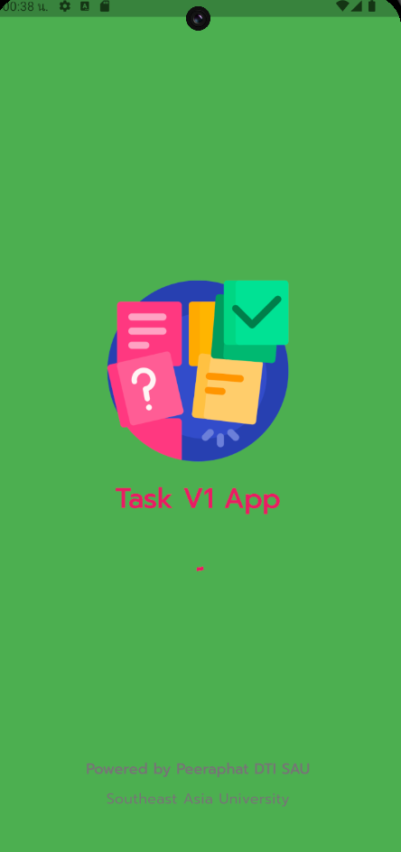
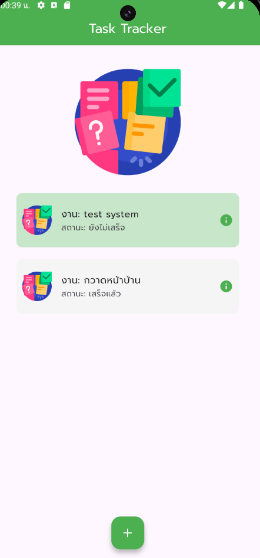
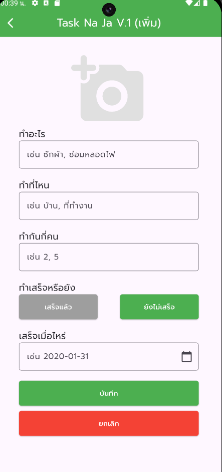
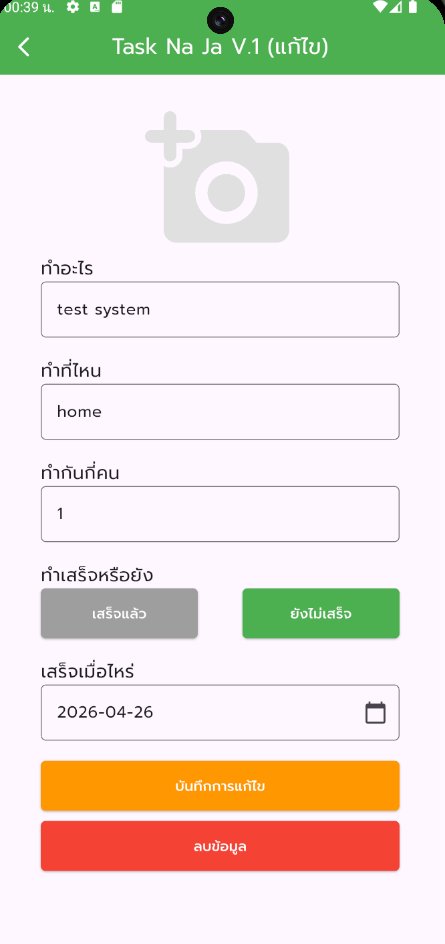

# 📝 Task Management App

แอปพลิเคชันจัดการงาน (Mini Project) พัฒนาด้วย Flutter และ Supabase

## ✨ ฟีเจอร์เด่น
- **Real-time Synchronization:** ซิงค์ข้อมูลงานแบบเรียลไทม์
- **Cloud Storage:** รองรับการอัปโหลดรูปภาพขึ้น Supabase Storage
- **Full CRUD:** จัดการข้อมูลงานได้ครบถ้วน (เพิ่ม, ดู, แก้ไขสถานะ, ลบ)

## 🛠 Tech Stack
- **Frontend:** Flutter (Dart)
- **Backend:** Supabase (Database & Storage)
- **Packages:** `supabase_flutter`, `image_picker`, `google_fonts`

## 🗄️ Database Schema (SQL)
ใช้ตาราง `tasks` (หรือตามที่คุณตั้งชื่อไว้) ในการจัดเก็บข้อมูล:
```sql
create table tasks (
  id uuid primary key default gen_random_uuid(),
  task_name text not null,
  task_where text,
  task_person integer default 0,
  task_status boolean default false,
  task_duedate text,
  task_image_url text,
  created_at timestamptz default now()
);
```

## ภาพหน้าจอ (Screenshots)

| หน้าหลัก (Main) | แสดงรายละเอียด (Show) |
|:---:|:---:|
|  |  |

| เพิ่มงาน (Add) | แก้ไขหรือลบ (Edit/Delete) |
|:---:|:---:|
|  |  |

## 👨💻 ผู้พัฒนา
**นายพีระภัทร ขุนรักพรหม** นักศึกษาคณะเทคโนโลยีสารสนเทศ มหาวิทยาลัยเอเชียอาคเนย์ (SAU)
*flutter_task_v1_app Complete*
